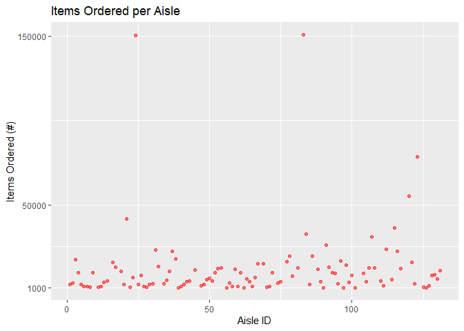

p8105\_hw3\_kq2127
================
Kristal Quispe
10/12/2019

## Problem 1

``` r
data("instacart")

instacart %>% 
  group_by(aisle_id) %>% 
  summarize(n_obs = n()) %>% 
  arrange(desc(n_obs))
```

    ## # A tibble: 134 x 2
    ##    aisle_id  n_obs
    ##       <int>  <int>
    ##  1       83 150609
    ##  2       24 150473
    ##  3      123  78493
    ##  4      120  55240
    ##  5       21  41699
    ##  6      115  36617
    ##  7       84  32644
    ##  8      107  31269
    ##  9       91  26240
    ## 10      112  23635
    ## # ... with 124 more rows

``` r
instacart %>%
  group_by(aisle_id) %>%
  summarize(n_obs = n()) %>% 
  filter(n_obs > 1000) %>% 
  ggplot(aes(x = aisle_id, y = n_obs)) + 
    geom_point(color = "red", alpha = .5) +
  labs(
    title = "Items Ordered per Aisle",
    x = "Aisle ID",
    y = "Items Ordered (#)"
  )+
  scale_y_continuous(
    breaks = c(1000, 50000, 150000)
  )
```

<!-- -->

``` r
instacart %>%
  group_by(aisle_id, product_name) %>%
  summarize(n_obs = n()) %>% 
  arrange(aisle_id, desc(n_obs))
```

    ## # A tibble: 39,123 x 3
    ## # Groups:   aisle_id [134]
    ##    aisle_id product_name               n_obs
    ##       <int> <chr>                      <int>
    ##  1        1 Tuna Salad                   208
    ##  2        1 Classic Chicken Salad        200
    ##  3        1 Chicken Noodle Soup          165
    ##  4        1 Organic Southwest Salad      157
    ##  5        1 Cut Hearts Of Palm           153
    ##  6        1 Chicken Tortilla Soup        120
    ##  7        1 Egg Salad                     81
    ##  8        1 Chicken Salad                 79
    ##  9        1 Tuscan Kale & Quinoa Salad    79
    ## 10        1 Edamame                       77
    ## # ... with 39,113 more rows

``` r
 ## sum(x[,'n_obs'])
```

Data set instacart has 1384617 observations and 15 variables.There are
134 aisles, and aisle number 83 has the most items ordered from
(150609).

## Problem 2

``` r
data("brfss_smart2010")
```
