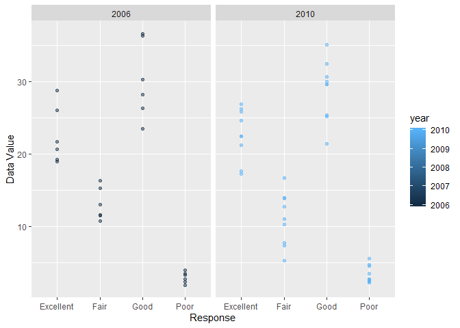

p8105\_hw3\_kq2127
================
Kristal Quispe
10/12/2019

## Problem 1

``` r
data("instacart")

instacart %>% 
  group_by(aisle_id, aisle) %>% 
  summarize(n_obs = n()) %>% 
  arrange(desc(n_obs))
```

    ## # A tibble: 134 x 3
    ## # Groups:   aisle_id [134]
    ##    aisle_id aisle                          n_obs
    ##       <int> <chr>                          <int>
    ##  1       83 fresh vegetables              150609
    ##  2       24 fresh fruits                  150473
    ##  3      123 packaged vegetables fruits     78493
    ##  4      120 yogurt                         55240
    ##  5       21 packaged cheese                41699
    ##  6      115 water seltzer sparkling water  36617
    ##  7       84 milk                           32644
    ##  8      107 chips pretzels                 31269
    ##  9       91 soy lactosefree                26240
    ## 10      112 bread                          23635
    ## # ... with 124 more rows

Data set instacart has 1384617 observations and 15 variables. There are
134 aisles, and aisle number 83 (fresh vegetables) has the most items
ordered from (150609).

``` r
instacart %>%
  group_by(aisle_id) %>%
  summarize(n_obs = n()) %>% 
  filter(n_obs > 1000) %>% 
  ggplot(aes(x = aisle_id, y = n_obs)) + 
    geom_point(color = "red", alpha = .5) +
  labs(
    title = "Items Ordered per Aisle",
    x = "Aisle ID",
    y = "Items Ordered (#)"
  ) +
  scale_y_continuous(
    breaks = c(1000, 50000, 150000)
  )
```

<!-- -->

``` r
instacart %>%
  filter(aisle == "baking ingredients" | aisle == "dog food care" | aisle == "packaged vegetables fruits") %>% 
  group_by(aisle, product_name) %>%
  summarize(n_obs = n()) %>% 
  arrange(aisle, desc(n_obs)) %>% 
  mutate(rank = min_rank(-n_obs)) %>% 
  filter(rank == 1 | rank ==2 | rank ==3) %>% 
  select(Aisle = aisle, Product = product_name, Count = n_obs) %>% 
  knitr::kable()
```

| Aisle                      | Product                                       | Count |
| :------------------------- | :-------------------------------------------- | ----: |
| baking ingredients         | Light Brown Sugar                             |   499 |
| baking ingredients         | Pure Baking Soda                              |   387 |
| baking ingredients         | Cane Sugar                                    |   336 |
| dog food care              | Snack Sticks Chicken & Rice Recipe Dog Treats |    30 |
| dog food care              | Organix Chicken & Brown Rice Recipe           |    28 |
| dog food care              | Small Dog Biscuits                            |    26 |
| packaged vegetables fruits | Organic Baby Spinach                          |  9784 |
| packaged vegetables fruits | Organic Raspberries                           |  5546 |
| packaged vegetables fruits | Organic Blueberries                           |  4966 |

``` r
instacart %>% 
  filter(product_name == "Pink Lady Apples" | product_name == "Coffee Ice Cream" ) %>% 
  mutate(
    day = recode(
      order_dow,
      "0" = "Sunday",
      "1" = "Monday",
      "2" = "Tuesday",
      "3" = "Wednesday",
      "4" = "Thursday",
      "5" = "Friday",
      "6" = "Saturday")) %>% 
  group_by(product_name, day) %>% 
  summarize(
    mean_hod = mean(order_hour_of_day)
         )%>% 
  pivot_wider(names_from = day, values_from = mean_hod)%>% 
  select(product_name, Sunday, Monday, Tuesday, Wednesday, Thursday, Friday, Saturday) %>% 
  knitr::kable()
```

| product\_name    |   Sunday |   Monday |  Tuesday | Wednesday | Thursday |   Friday | Saturday |
| :--------------- | -------: | -------: | -------: | --------: | -------: | -------: | -------: |
| Coffee Ice Cream | 13.77419 | 14.31579 | 15.38095 |  15.31818 | 15.21739 | 12.26316 | 13.83333 |
| Pink Lady Apples | 13.44118 | 11.36000 | 11.70213 |  14.25000 | 11.55172 | 12.78431 | 11.93750 |

## Problem 2

Data Cleaning

``` r
data("brfss_smart2010")

pb2_df =
  brfss_smart2010 %>% 
  janitor::clean_names() %>% 
  filter(topic == "Overall Health", response %in% c ("Poor", "Fair", "Good", "Excellent")) %>% 
  mutate(response = as.factor(response)) 
```

Using the dataset…

``` r
pb2_df %>% 
  filter( year == 2002) %>% 
  group_by(locationabbr) %>%
  summarize(
    n_unique = n_distinct(locationdesc))%>%  
  filter(n_unique >= 7)
```

    ## # A tibble: 6 x 2
    ##   locationabbr n_unique
    ##   <chr>           <int>
    ## 1 CT                  7
    ## 2 FL                  7
    ## 3 MA                  8
    ## 4 NC                  7
    ## 5 NJ                  8
    ## 6 PA                 10

``` r
pb2_df %>% 
  filter( year == 2010) %>% 
  group_by(locationabbr) %>%
  summarize(
    n_unique = n_distinct(locationdesc))%>%  
  filter(n_unique >= 7)
```

    ## # A tibble: 14 x 2
    ##    locationabbr n_unique
    ##    <chr>           <int>
    ##  1 CA                 12
    ##  2 CO                  7
    ##  3 FL                 41
    ##  4 MA                  9
    ##  5 MD                 12
    ##  6 NC                 12
    ##  7 NE                 10
    ##  8 NJ                 19
    ##  9 NY                  9
    ## 10 OH                  8
    ## 11 PA                  7
    ## 12 SC                  7
    ## 13 TX                 16
    ## 14 WA                 10

In 2002 the following states were observed at 7 or more locations: CT,
FL, MA, NC, NJ and PA. In 2010 the following states were observed at 7
or more locations:CA, CO, FL, MA, MD, NC, NE, NJ, NY, OH, PA, SC, TX and
WA.

``` r
pb2_df %>% 
  filter(response == "Excellent") %>% 
  group_by(year, locationabbr) %>% 
  summarize(mean_dv = mean(data_value)) %>% 
  ggplot(aes(x = year, y = mean_dv, color = locationabbr)) + 
  geom_point() +
  geom_line() + 
  theme(legend.position = "bottom")
```

    ## Warning: Removed 4 rows containing missing values (geom_point).

    ## Warning: Removed 3 rows containing missing values (geom_path).

<!-- -->

``` r
pb2_df %>% 
  filter( year == 2006 | year == 2010, locationabbr == "NY") %>%
  ggplot(aes(x = response, y = data_value, color = year)) + 
  geom_point(alpha = .5) +
  geom_smooth(se = FALSE) + 
  facet_grid(~ year)
```

    ## `geom_smooth()` using method = 'loess' and formula 'y ~ x'

<!-- -->

## Problem 3

Load, tidy and wrangle data.

``` r
pb3_df1 = 
  read_csv(
    file = "./data/accel_data.csv") %>% 
  janitor::clean_names() %>% 
  mutate(
    day_type = case_when(
      day  %in% c ("Saturday", "Sunday") ~ "Weekend",
      day  %in% c ("Monday", "Tuesday", "Wednesday", "Thursday", "Friday") ~ "Weekday",
      TRUE      ~"" 
    )) %>% 
  select(week, day_id, day, day_type, everything())
```

    ## Parsed with column specification:
    ## cols(
    ##   .default = col_double(),
    ##   day = col_character()
    ## )

    ## See spec(...) for full column specifications.

After loading the accel data set and tidying it we end up with pb3\_df
data set. This data set has 35 observations with 1444 variables. The
variables in this data set include: week, day\_id, day, day\_type, and
multiple activity variables ranging from activity\_1 to activity\_1440.

``` r
pb3_df2 =
  pb3_df1%>% 
  pivot_longer(
    activity_1:activity_1440,
    names_to = "minute_of_day", 
    names_prefix = "activity_",
    values_to = "activity") %>% 
  group_by(week, day_id, day, day_type) %>% 
  summarize(total_activity = sum(activity))

pb3_df2 %>% 
  knitr::kable()
```

| week | day\_id | day       | day\_type | total\_activity |
| ---: | ------: | :-------- | :-------- | --------------: |
|    1 |       1 | Friday    | Weekday   |       480542.62 |
|    1 |       2 | Monday    | Weekday   |        78828.07 |
|    1 |       3 | Saturday  | Weekend   |       376254.00 |
|    1 |       4 | Sunday    | Weekend   |       631105.00 |
|    1 |       5 | Thursday  | Weekday   |       355923.64 |
|    1 |       6 | Tuesday   | Weekday   |       307094.24 |
|    1 |       7 | Wednesday | Weekday   |       340115.01 |
|    2 |       8 | Friday    | Weekday   |       568839.00 |
|    2 |       9 | Monday    | Weekday   |       295431.00 |
|    2 |      10 | Saturday  | Weekend   |       607175.00 |
|    2 |      11 | Sunday    | Weekend   |       422018.00 |
|    2 |      12 | Thursday  | Weekday   |       474048.00 |
|    2 |      13 | Tuesday   | Weekday   |       423245.00 |
|    2 |      14 | Wednesday | Weekday   |       440962.00 |
|    3 |      15 | Friday    | Weekday   |       467420.00 |
|    3 |      16 | Monday    | Weekday   |       685910.00 |
|    3 |      17 | Saturday  | Weekend   |       382928.00 |
|    3 |      18 | Sunday    | Weekend   |       467052.00 |
|    3 |      19 | Thursday  | Weekday   |       371230.00 |
|    3 |      20 | Tuesday   | Weekday   |       381507.00 |
|    3 |      21 | Wednesday | Weekday   |       468869.00 |
|    4 |      22 | Friday    | Weekday   |       154049.00 |
|    4 |      23 | Monday    | Weekday   |       409450.00 |
|    4 |      24 | Saturday  | Weekend   |         1440.00 |
|    4 |      25 | Sunday    | Weekend   |       260617.00 |
|    4 |      26 | Thursday  | Weekday   |       340291.00 |
|    4 |      27 | Tuesday   | Weekday   |       319568.00 |
|    4 |      28 | Wednesday | Weekday   |       434460.00 |
|    5 |      29 | Friday    | Weekday   |       620860.00 |
|    5 |      30 | Monday    | Weekday   |       389080.00 |
|    5 |      31 | Saturday  | Weekend   |         1440.00 |
|    5 |      32 | Sunday    | Weekend   |       138421.00 |
|    5 |      33 | Thursday  | Weekday   |       549658.00 |
|    5 |      34 | Tuesday   | Weekday   |       367824.00 |
|    5 |      35 | Wednesday | Weekday   |       445366.00 |

Some trends I noticed were that Fridays have the most actiivty while
saturdays have the least activity. The patient was more active during
the first 3 weeks compared to the last two weeks of the study.

``` r
pb3_df3 =
  pb3_df1%>% 
  pivot_longer(
    activity_1:activity_1440,
    names_to = "minute_of_day", 
    names_prefix = "activity_",
    values_to = "activity") %>% 
  mutate( 
    minute_of_day = as.numeric(minute_of_day),
    hour = (minute_of_day %/% 60)) %>% 
  group_by(day_id, hour) %>% 
  summarize( hr_activity = sum(activity)) %>% 
  ggplot(aes(x = hour, y = hr_activity, color = as.factor(day_id))) + 
  geom_point() +
  geom_line() + 
  theme(legend.position = "bottom")

pb3_df3
```

<!-- -->
